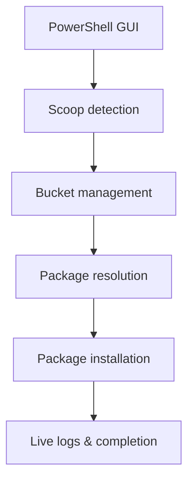

# Scoop Setup

[](https://github.com/PowerShell/PowerShell)
[](https://www.microsoft.com/windows/)
[](LICENSE)
[](https://github.com/nihitdev/tools-setup/releases/tag/v1.0.0)

A polished Windows GUI for Scoop installs. Search, select, install.

---

## Demo


> Replace `assets/demo.gif` with a 900×500, 10 FPS recording under 5MB.

---

## Install

```powershell
git clone https://github.com/nihitdev/tools-setup.git
cd tools-setup
powershell -ExecutionPolicy Bypass -File .\scoop-setup.ps1
```

Or download `scoop-setup.ps1`, open PowerShell as Administrator, and run:

```powershell
powershell -ExecutionPolicy Bypass -File .\scoop-setup.ps1
```

Requirements:
- Windows 10+ / 11
- PowerShell 5.1+
- Administrator access
- Internet connection

---

## Why Scoop Setup?

Fresh Windows developer setups are slow and repetitive.

Scoop Setup turns Scoop into a polished GUI installer, auto-manages buckets, detects installed apps, and saves selections for repeatable installs.

---

## Features

- Modern dark Windows Forms GUI
- Search and filter packages instantly
- Batch install multiple tools with one click
- Auto-add required buckets
- Detects already-installed apps
- Live progress and colorized logs
- Export/import package selections
- Reuse existing Scoop installs
- Rust support via rustup

---

## Screenshots


---

## Architecture



---

## Showcase

Ready for developers setting up:
- VS Code
- Helix
- Docker
- Rust
- Go
- Python
- Node.js
- Git workflows

---

## Included Software

Examples:
- Git, 7zip, curl, jq
- VS Code, Helix, Notepad++
- Python, Node.js, Go, Deno, Rust, JDK
- Docker, Docker Compose, ArchWSL
- Nerd fonts, Brave, Discord, Bitwarden

---

## Roadmap

- [x] Modern GUI
- [x] Search and filter
- [x] Multi-select install
- [x] Live logs
- [x] Scoop detection
- [ ] Package profiles
- [ ] Winget backend
- [ ] Chocolatey backend
- [ ] Theme settings

---

## FAQ

Is it safe?  
Yes. It only installs Scoop packages and manages Scoop buckets.

Already have Scoop?  
Yes. Existing Scoop installs are detected and reused.

Where are logs?  
Saved to `%TEMP%` with a timestamp.

Can I use it offline?  
No. Internet is required.

---

Built for developers who reinstall Windows too often.

---

## License

MIT License.
